# Website-Project-Humble_Abode
mddn242 project 1 - Anouk's Humble Abode website

# goals:
    my main goal is to use my own skills and AI to create a website that I am happy with. It is very important to me that I enjoy the process of interacting with the AI and using it to help me rather than the AI doing everything and me having no control over it. Due to this I will be making a 'simple' project where I use the AI to do 'simple' tasks rather than very complicated ones because this means that I will understand the code and be able to change things with the knowledge that i have and not have to fully rely on the AI to do everything, but also so that the AI has less chance of messing up and I can spend time on the creative side of things rather than having to focus on writing good prompts for the AI to follow as that is not what 'designing' means to me. 

# working with AI
im using Calude AI (sonnet 4.6) to help me code things that I dont have the skills to do and are too big and out of scope for me to learn via the internet for this project

# Notes:
    24/03/26
    This is my second try at using AI to make a website. My first attempt wasnt as successful as I had hoped due to numerous factors with the main one being that I was no longer having fun due to having to rely on the AI to do all the coding. This is probably since I made my project 'a little' too complicated and therefore I wasnt able to do any coding myself and my 'work' on the project got reduced to me just writing prompts to get the AI to do exactly what I wanted, which isnt fun for me in any way.
    I am now starting again where I make a much simpler website where i do most of the work by doing all art myself and just using the AI for certain functions and setting up the base elements.
    25/03/26
    very happy with progress so far
    I used Claude AI to create a 'base layer' which i can use to insert and position images that I have drawn by hand. This is the only thing the AI helped me make and took about 5min. The rest I did today all by myself with help from websites (e.g. https://developer.mozilla.org/en-US/docs/Web/HTML/Reference/Elements). Im very happy and proud with what ive done in the past 2 days and how much of it I did myself. I understand pretty much all the code (especially the stuff I have been changing) which im very pleased with.
    The 'workflow' of using AI to get a start when not knowing how to due to not having the skills is actually quite useful as you can use it to also learn how to do it and then do it yourself in the future. In a way its similar to googling how to do it and pasting in a piece of code someone else did and using it to build your own. This works a lot better for me than the last project where I was 'fully' relying on AI to build my project. I think a big help in that is choosing a simpler project because realistically I have the knowledge to do it all myself with slow janky code but i can use the AI to help speed up certain parts or help understand things I dont know.
    Overall im happy! maybe mainly because I got to do things myself rather than using the AI. 
    02-04-26
    Very happy with the turn out of the project. I am very glad that I made the decision to restart as my new approach was may more aligned with my goals for the project and I managed to create a Website I would actually use. 
    I did sadly run out of time and wasnt able to add all the other cool things but maybe I will do that outside of the project. 
    Im still on the fence and hesitant about AI but i am not as against it as before depending on how it is used

# references:

my own art:
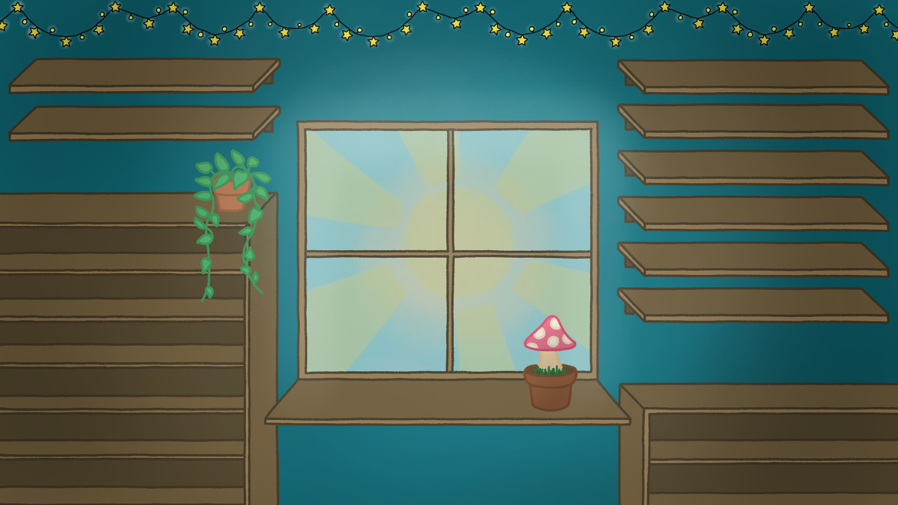 <- my desktop background that I drew myself, with shelves to align all my files
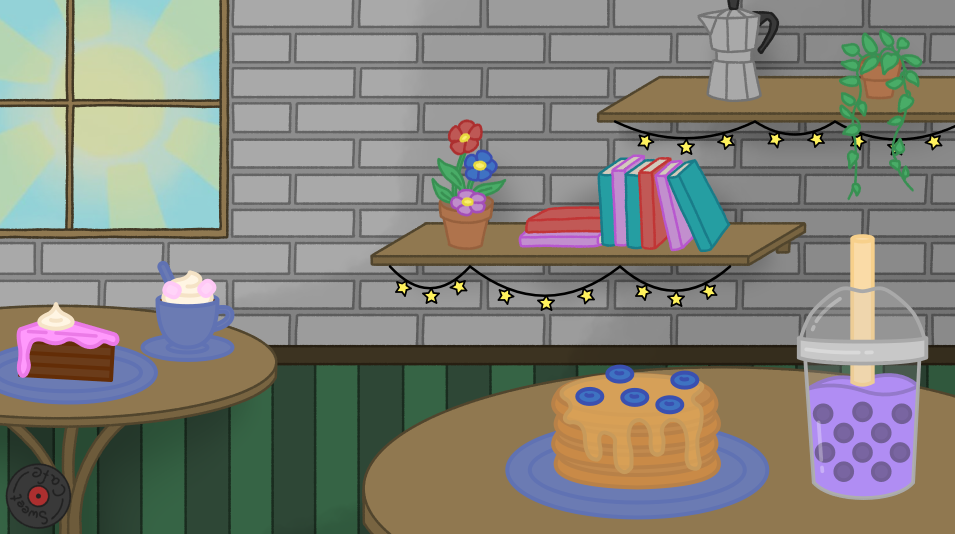 <- a drawing I did for a uni project where certain elements move with the music. I really like this idea as it makes it feel lively. 

other websites that inspired me: 
https://caby.neocities.org <- I like the simplicity of it and how much personality it has, i feel like you can tell a lot about the person just by looking at the landing page, has a cool way of navigating to different pages (clicking on items in the drawing)
https://ashmosphere.net <- also a 'bedroom' scene. I like how the items that are clickable light up to show the user that they are intractable
https://starite.neocities.org <- I like how the art is laid out and how it things have a paper texture. 
https://blazermaze.neocities.org <- the landing page and the way the user enters is kinda cool

# design plan/ideas:
I want the website to be cosy and not overwhelming. I want everything to have a hand-drawn/hand-crafted feeling which is why I am drawing everything myself on my tablet. 

All pages:
    -text in top left saying 'Hi! please view this website on a monitor and full screen the page for the best experience'
    -if user is on mobile text that say 'Hi! im really sorry but this website is not currently functional on mobile, please use a computer/ bigger screen'  
    -icon in top right corner which opens a menu 'banner' or right hand side of page
    ⤷ easy navigation to other pages
    ⤷ basic music controls (e.g. skip, pause, volume etc.)
    ⤷ toggle custom cursor 
    ⤷ info on how page is made (AI declaration)
    ⤷ copy right thingy
    ⤷ website last updated
    -logo in top left corner which brings user back to home page when clicked on (apart from home page where the 'Anouk's Humble Abode' sign has this function and 'reloads the page')
    -small 'back arrow' in bottom left which brings user to previous page

🚪landing/index page:
    -drawing of a small house aka 'my house'
    -door which the user clicks on to enter into the room and get to the main/home page.
    -animated background where plants move, critters runs across, and the sun/moon changes depending on my current time (aka nz time), weather changes depending on weather somewhere in nz? (dont really want to dox where i live so might just use auckland weather to stay safe)

🏠Home page:
    This is the main page for my website which looks like a bedroom and has clickable images/items that the user can interact with to see more information and navigate to other pages.
    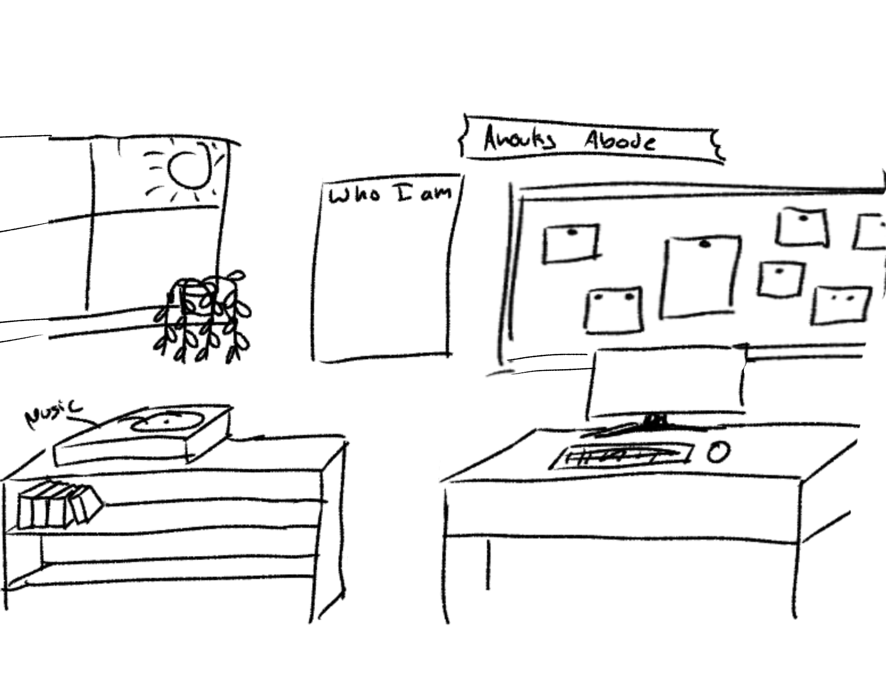
    Elements:
    -'who am I' poster on the wall -> opens 'about page'
    -corkboard -> opens 'gallery page'
    -computer -> opens 'PC page' (if out of scope will replace with books and drawing things on table)
    -record player -> opens 'music control page' (disk in record player spins when music is playing?)
    -clock which displays my current time. when clicked on text appears saying 'it is currently ---- for Anouk meaning they are most likely ---- right now'. (Would be cool to have traditional rather than analogue but idk how to do that. hopefully the AI knows how)
    -window changes from day to night depending on my time
    ======if still time====
    -different books -> open different 'interest' pages
    -different trinkets -> open info about them (link, images etc.)
    -top drawer of desk -> open 'top view of drawer' which is filled with lots of little paper with random facts on them
    -phone on desk -> shows current 'favorite' apps 
    
⭐About Page:
    displays poster (which is hanging on the wall in the home page) showing the following information
    -my name and pronouns
    -doodle of me
    -contact information
    -small blurb about me (goals, values, interest)
    -fun facts

🖼️Gallery page:
    displays corkboard (from home page)
    -user scrolls or moves bar at bottom to move along the corkboard, left to right (directions are displayed on a sticky note next to 'My work' paper at the start of the corkboard)
    -works are displayed as sticky notes and paper print outs with name below them, all attached using pins
    -user can press on individual works for them to open bigger with a small description on the side about the work

💻PC page: (may be out of scope)
    shows computer desktop with clickable folders ect
    -folder with current favorite games
    -folder with 100% completed games
    -browser with different tabs for different interest (e.g. youtube's I watch, cool articles, fun facts etc)

🎵Music Control Page: 
    these controls are also in the 'menu' but here they are more in-depth and show more info
    -shows current song and link to find it on spotify/youtube
    -music controls -> skip/go back a song, change volume, Pause/Play etc.

25/03/26
**starting the project via the home**
asking _AI_ to help set up base structure:
prompt 1:
    Hello
    Can you please help me transform 'index.html'. preferably don't touch the .js file or the css file unless necessary. 
    Please start by making the entire background the following colour: #88AE92
    Can you please make a basic structure in the HTML file so that i can add images, scale them, and position them how i like in relation to the top right corner of the screen? 
    I also want to add a function where i can make certain images intractable so that when the user clicks them they get redirected to a different page 
    (i haven't gives you the pages nor images so please just add placeholder images or write -insert image here- or -insert redirection page here- where applicable?)
    Please let me know if you have any questions.
response: 
    Here's what was changed and how to use it:
    Background colour — added a body { background: #88AE92; } override directly in the 'style' block in the HTML, so styles.css is untouched.
    Image positioning system — there's a fixed 'img-layer' div that covers the full screen and is anchored to the top-right. Each image sits inside an .img-item div that you position using top and right in CSS. To place a new image:
    - Add an .img-item block in the HTML with a new id
    - Add a CSS rule like #img-4 { top: 500px; right: 30px; width: 200px; height: 150px; }
    - Swap the src for your real image path
    Clickable images — add class="img-item clickable" and set data-href="your-page.html" on the div. The script at the bottom handles both click and keyboard navigation automatically. Non-interactive images use class="img-item static".
output:
    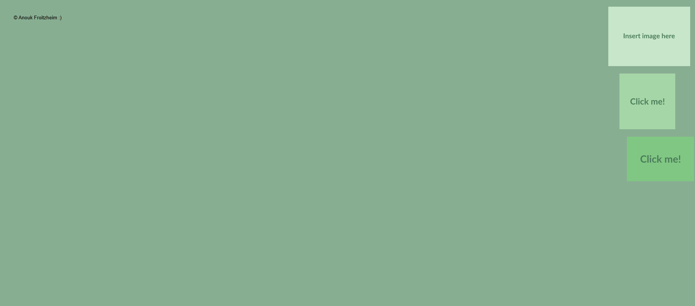
    
    
    
opinion:
    i accidentally asked it to relate it to the top right instead of the top left like i intended.. oopsieee... Easy fix by just changing all the 'right's to 'left's.
    I like how it added a slight 'expand' to clickable images when they are hovered over. I was intending to ask it to add something like this but it already did it :D

_Own work:_
**-Changed 'copy right' font to 'pixelify+sans'**
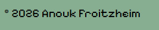
    font used: https://fonts.google.com/specimen/Pixelify+Sans?query=pixel
    ⤷ loaded in 'pixelify+sans' font from google to HTML file (this needs to be added to every HTML file in order for the font to work. I couldnt manage to make it work so that its only necessary in the css file)
    ⤷ added 'copyright' class to style.css which changes the font, and position of the 'copyright section' so that it is always in the bottom left corner. 
    ⤷ 26/03/26 moved where copyright is 'drawn' in loop to make sure its always drawn on top of images
    ⤷ 29/03/26 made text slightly transparent (same as 'disclaimer text') and separated the words into two lines so that it doesnt overlap the images (on home page)

**-loaded 'layout image' in to see where to place individual images and ran into an issue:**
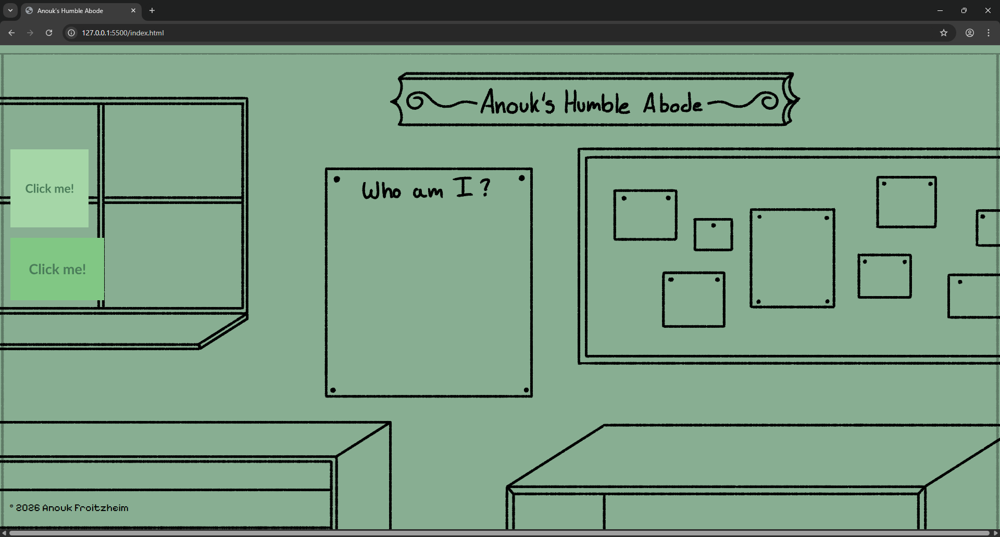
    -issue is that i drew the layout for '1920x1080' but didnt calculate in the space of the monitor that the actual browser window takes up (e.g. search bar, tabs, etc.), which means that my Image is not on thhe correct scale nor will it fit without parts being cut off or awkward gaps
    -My solution is to have a small border around the entire layout so that everything can be seen, instead of having the image go all the way to the edge. This will also make the site more accessible from different devices and window sizes.
    -currently everything is drawn from the top left but I instead want everything to centre around the top middle. This should be easy to do by using '50vw' (50% of the viewport width).
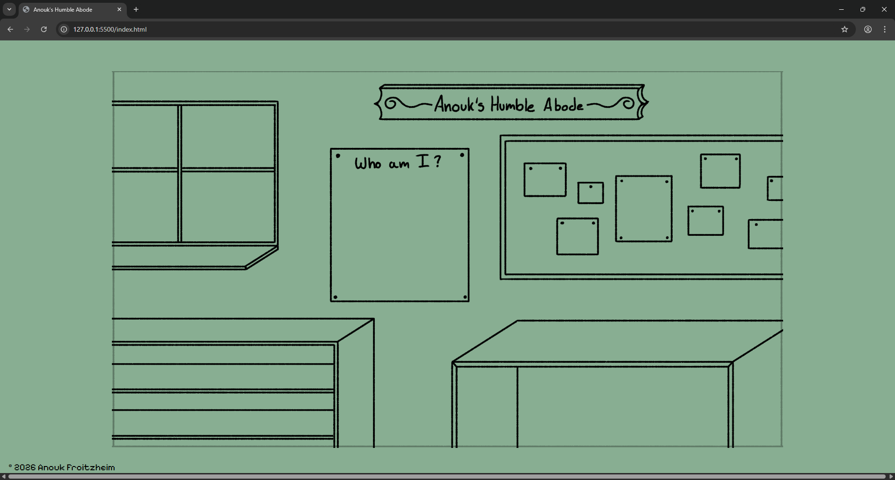
    issue fixed
    -changed '.img-layer' to be at centre of page and changed size of 'layout image' to have a border around it. 
    ⤷ not sure yet if im happy with this change. I liked having the entire 'browser window' be the room rather than just a small portion of it, as it made me feel like I was 'actually there'. However like this it is more accessible from different window sizes which is also good.
    i will work on adding images and the functionality of the page for now and then have another look at how to improve this so that I am 100% happy.
    If i want it to fill the whole frame I may have to resize some things in my layout so that they fit properly which should not be a problem (id just have to redraw some elements)
    ⤷update 26/03/26 keeping the 'window view' because otherwise scaling will be an issue and with a frame it looks cleaner. Using a place holder frame for now but it doesnt feel very 'on theme'. i dont mind how it looks with the basic frame as it is very simple and straight forward but I feel like the frame is another potential area where i can 'show my personality' so I will keep thinking. 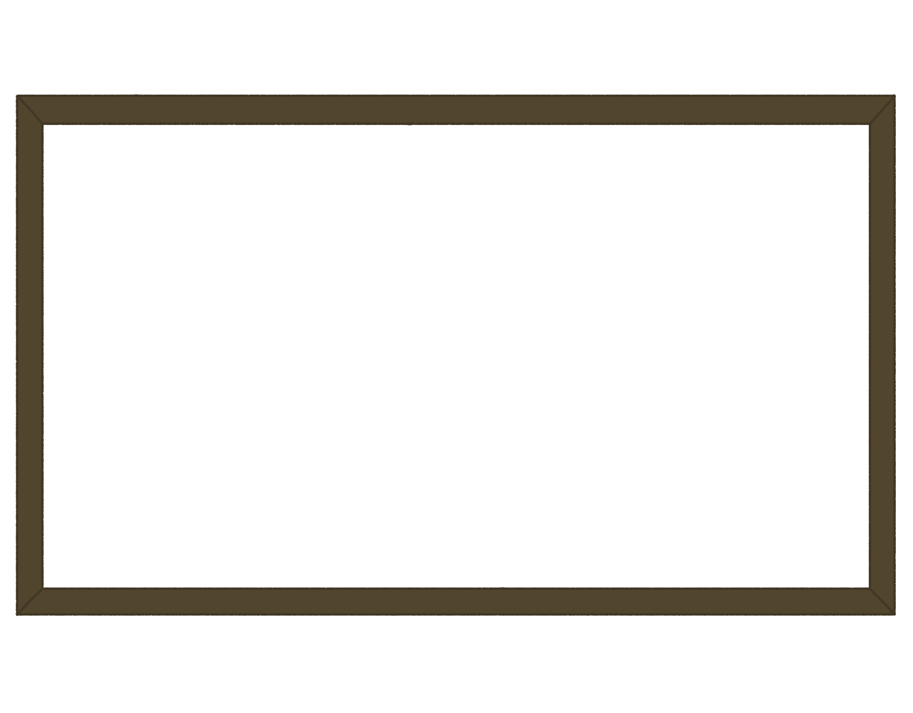
    ⤷ 1/02/26 update:
    redrew some things and added a 'floor' in order to get rid of the 'frame view' and instead have the entire page filled with the room. 
    
    
    -when page is on upright monitor, floor doesnt go fully down the page. changed by instead of having the floor be an image i made it the backgournd colour and instead loaded in an image of the wall
    
    also resized 'disclaimer' so it doesnt overlap any images
    

**-loading images in with relation to vw to keep same spacing regardless of window size**
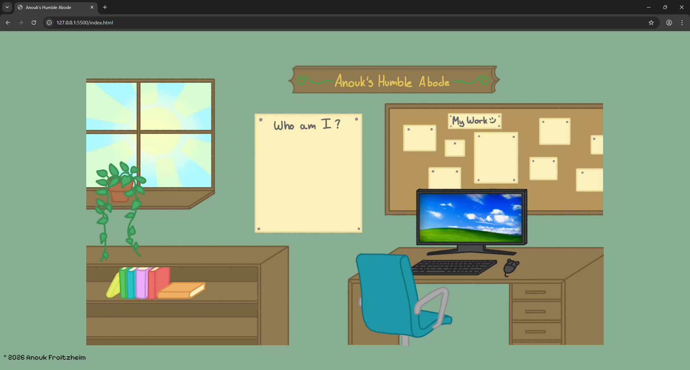
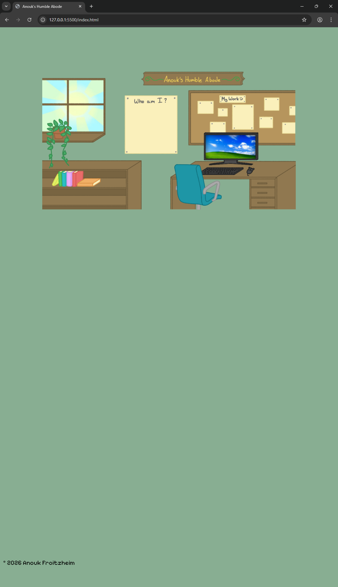
    everything scales properly when changing window size due to building everything in relation to window width meaning it is also mobile compatible
    -using AI image placement template has been very useful

**-about page**
    added images in position and sizes to look as though it is a zoomed in version of the home page and as if the user has walked closer to the wall. 
    The 'poster image' in the home page now links to the about page when clicked on (click and redirect function was coded by AI)
    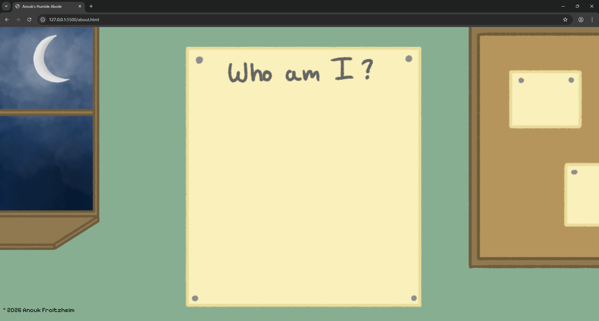
    -update:
        added rest of images so that full scene is visible when window is full screen on an upright monitor
        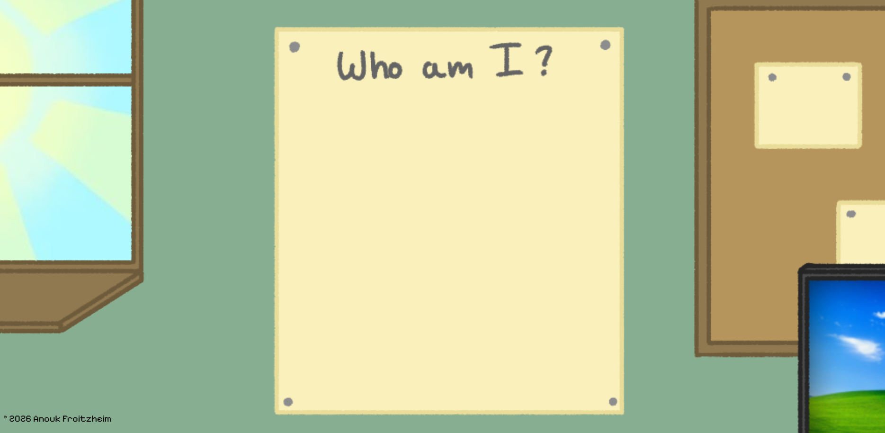 (full screen horizontal monitor)
        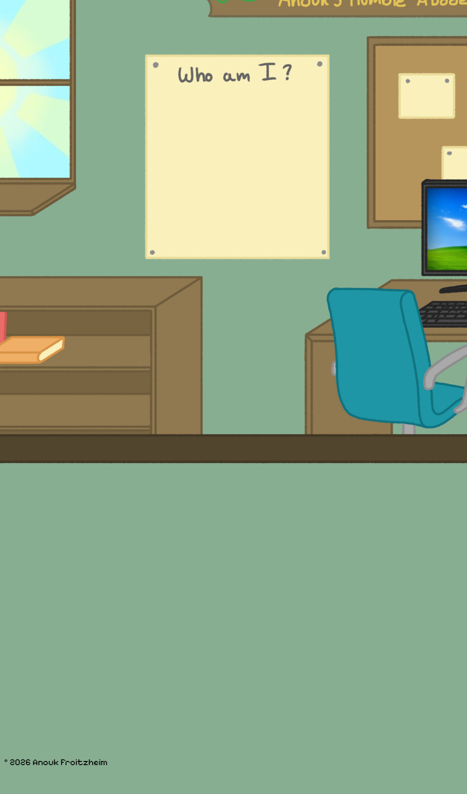 (full screen vertical monitor, similar to what it would look like on mobile)

**-transition** _with AI_
prompt: 
    Hi there!
    Can you please help me make a transition when the user travels between html pages?
    It is currently set up that the user presses an image (e.g. the 'poster' image in the index html) and then gets redirected to the corresponding html using the following script: 
        // =============================================
        // CLICKABLE IMAGE REDIRECT HANDLER
        // Works for both mouse clicks and keyboard Enter/Space.
        // Just set data-href="your-url" on any .img-item.clickable
        // and this script handles the rest automatically.
        // =============================================
        document.querySelectorAll('.img-item.clickable').forEach(item => {
        const target = item.dataset.href;
        if (!target || target === 'INSERT-REDIRECT-PAGE-HERE') return;

        
        item.addEventListener('click', () => {
            window.location.href = target;
        });

        item.addEventListener('keydown', e => {
            if (e.key === 'Enter' || e.key === ' ') {
            e.preventDefault();
            window.location.href = target;
            }
        });
        });
    Please use this to create a transition so that the scene from the starting html 'melts' into the scene of the target html.
    I would like this to be done with very minimal code and so that I can easily tweak things like how long the transition takes.
    Please let me know if you have any questions
response: 
    What a fun personal site! Here's what I'd suggest for the "melt" effect:The approach here is a single shared transition.js file you can drop in once and reference from every page. The melt effect uses a full-screen canvas that captures the current page, then pixelates/drips it away as the new page loads.
    Actually, the cleanest approach for a "melt" between real HTML pages is a CSS overlay technique — no canvas needed. Here's how it works:
    The idea: on click, instead of immediately navigating, you fade out the current page (with a slight downward drift to feel like melting), then navigate. The new page fades in on load. All timing is controlled by one CSS custom property.
    Replace the <script> block in both HTML files with this:

    What to tweak:
    TRANSITION_DURATION — increase for a slower, dreamier melt; decrease for snappier
    TRANSITION_DRIFT — how far the scene slides down as it melts out (and up as the new one arrives)
    The blur(6px) in the CSS — increase for a more extreme melt, set to blur(0px) for a clean fade with no blur
    The double requestAnimationFrame on the fade-in is important — it gives the browser one frame to paint the blurred/offset starting state before animating to the normal state, so the entrance is always smooth.
output:
    when navigating between pages the 'old' page slides downwards and fades, then the background is displayed for a short time and then the 'new' page fades in while sliding down from the top.
opinion:
    I quite like this at it is a smooth transition. I would prefer for the transition to seem more like the user is stepping closer to the wall which could be done by having the transition be a zoom in to the home page or a pop out of the clicked on image/new page. I tried asking AI to do that but it didnt look as I wanted as it just scaled up all the images and therefore messed up the placing. 
    The 'sliding fade' transition works for now as it gets the job done. I will focus on making the rest of the page functional and then come back to this after if i still have time.

**-navigation buttons**
    added 'home' and 'menu' button to the top right corner of every page. 
    'hom' button links to 'bedroom page'. Menu button currently not functional(check design plan at the top of readme for what it is supposed to do)
    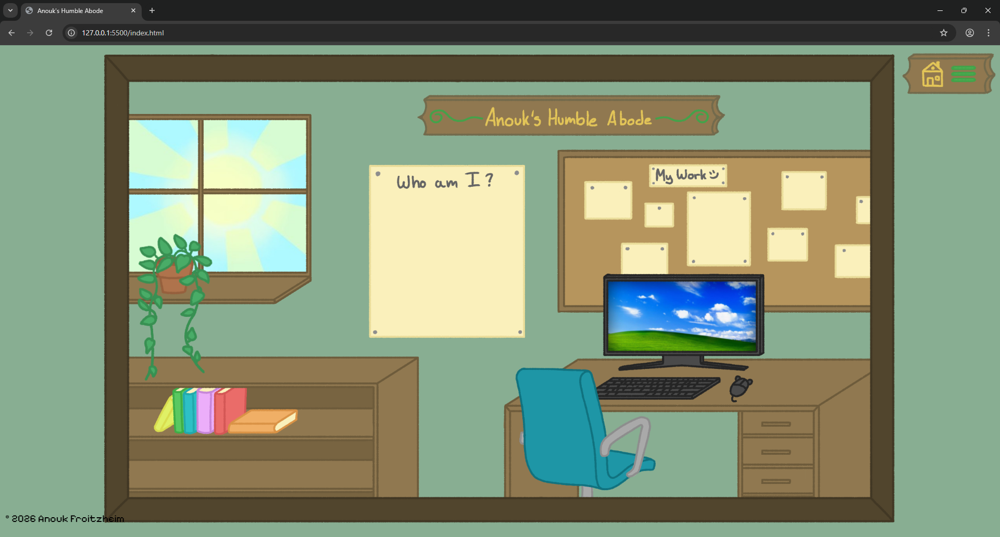
    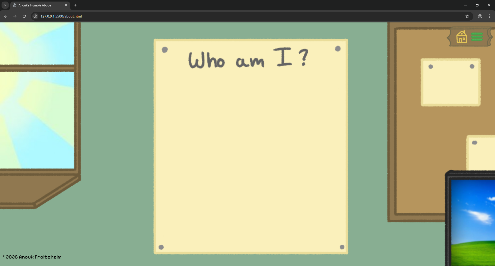
    buttons on about page 'blend' in a little and dont look as clear but are still functional. May change design of buttons later to stick out more if time allows it. 
    This change also means that the 'anouk's humble abode' sign in the bedroom is no longer clickable. 
    ⤷ 30/03/26
    changed wood colour of sign (same as frame) to make it more easy to notice and not blend into backgrounds. 
    
    ⤷ 1/04/26
    added music and back button
    functyion of back button was made _using AI_ but rest was by hand 
    (AI code: onclick="history.back()")
    

**-disclaimer text**
    -added a text to home page in the top left of the screen letting users know that the website is best viewed on laptop/PC on full screen. I made it a slightly transparent black so that it would be noticeable enough but not distracting from the overall page. The text is placed in a 'text box' so that it wraps so that it never covers the frame and always stays on the green in order to keep the text easy to read. (it overlaps when the window is made very very thin in width but very tall in height but this is a very unlikely screen size so shouldnt be a problem)
    colour of text is not up to 'accessability' standards. It would have to be fully black to meet them but that would make them stand out more and not align with design goals. Therefore this text is also written in the 'menu' text in full black. 
    Additionally, the text is not vital and the user can this experience the website without seeing/ reading it.
    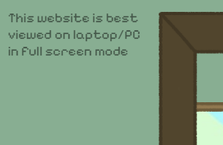

**-gallery page**
    made gallery page and added pictures of projects which can be clicked on to be redirected to relating 'project' page. 
    
    also updated what the corkboard looks like on all pages
    
    

**-project pages** 
all project pages will have the same build/layout 
due to time constraints I have only dont the wallpaper page for demonstration purposes (may do more if time allows for it)
- wallpaper page
    -change background colour to be same as corkboard
    -loaded image into wallpaper page
    ⤷ re-used the same image used in the gallery page. Ideally the paper and individual works would be their own separate images and therefore higher quality but for the scope of this project this is good enough (may change if time allows for it)
    -added a title and some text about the project
    

**-window changing day/night** _with AI_
prompt: 
    can you fetch the API from this website: https://api.sunrise-sunset.org/json?lat=-41.28&lng=174.77 which shows when sunset and sunrise are in nz so that i can add it into my html file?
    I want to use to to toggle the value of the opacity (represented by windowOpacity) in the following code (which is an ID placed in a style section in my html) on when it is day or night: 
    #window-day {
      width: 26.914vw;
      translate: -37.5vw -2.2vw;
      opacity: windowOpacity; 
    }
    please let me know if you have any questions
output: 
    CSS cannot use JavaScript variables directly like that — opacity: windowOpacity won't work as CSS doesn't know about JS variables.
    Instead you can set the opacity in the JS directly.
    
opinion:
    I tested this by imputing different co-ordinates in of where it is currently day/night
    happy with what it did. this was similar to what i attempted to make (spend about 2-3 hours doing it myself using what i found online) but wasnt able to because i didnt know the specific wording of things and had trouble finding them online. 

**-adding music player** _with AI_
this took me 4 hours with AI helping me the whole way as something wasnt correct in the code but figured it out in the end. I was so happy when it finally worked but also ready to give up. yet i was determined to make it look exactly how i envisioned (the perfectionist in me may be a hinder to my work progress but its fineeeee)

my prompts:
    Hi!
    Can you help me add a music player to my website using html?
    I have at least 3 songs that i want to load in.
    I want the user to be able to stop and start the music, skip the song, rewind the song and change the volume. I want to  make the buttons for the controls out of images that i have loaded in via the following code:

        

        
        

    I also want text that displays the current song. (i want to be able to fully edit the style of this text).
    Please let me know if you have any questions
output: 
    it was drawing the images behind my already created ones so i had to add it to my already existing 'image layer' class which fixed it
next challenge:
    how do i make it so that the music keeps playing on all pages of my website?
    This took quite a while of back and forth but it worked in the end. It could have worked quicker if I just gave the AI all my code but i didnt want to do that so that it didnt change things it wasnt supposed to and preferred for it to give me things i can copy and paste into my code so that I know what it is adding and can figure out how it works. 
next challenge:
    audio controlls
    I wanted to use my own images. the AI created code seemed to just load in the browsers default volume control so it was different across browsers which i didnt like as it didnt match my art style at all. 
    this is what took the most amount of time as the mouse input wasnt registering and then not being transferred (or something like that... i still dont fully understand but am happy its fixed)
all the final code made with AI and some of my own trouble shooting

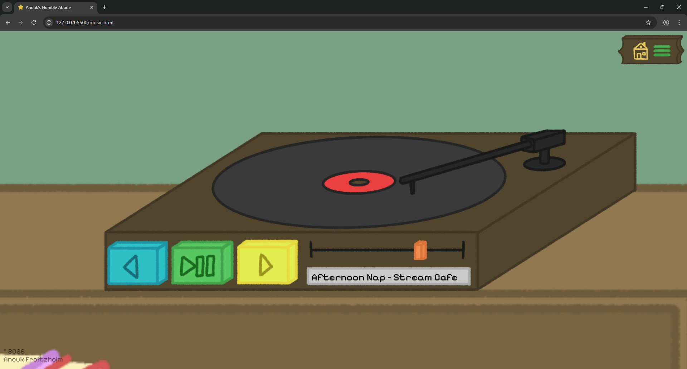

**-Menu Page**
Page to which the menu buttons goes. 
-has navigation menu
-disclaimer from home page about best viewing on laptop/desktop
-AI use information
